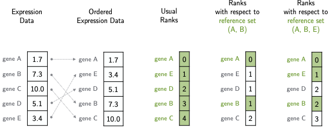

optirank: classification with optimal ranking reference genes for RNA-Seq data
=============================
[](https://www.gnu.org/licenses/gpl-3.0)

The model optirank fits a logistic regression model on ranks with respect to a learnable reference set. <br>
Excluding certain genes from the reference set produces a ranking which is robust and invariant to perturbations in those genes.



## Requirements

To install required packages:

```setup
conda env create -f optirank.yml
```
Install also pySCN following instructions from https://github.com/pcahan1/PySingleCellNet/tree/master

>📋 Follow [these instructions](utilities/optirank/src/BCD/prox/sum_gamma_fixed/README.md) for building the cython code.

The classifier optirank is implemented as a [scikit-learn classifier](https://scikit-learn.org/stable/developers/develop.html).
The source code is in *utilities/optirank*

## Synthetic data with a non-monotone perturbation

| classifier_name              | test balanced accuracy (%) |
|:-----------------------------|:---------------------------|
| logistic_regression          | 78 ± 2                     |
| logistic_regression_on_ranks | 80 ± 3                     |
| optirank                     | 96 ± 0                     |

In this example, optirank provides a decisive advantage over its full-ranked counterpart.<br>
We suppose that a group of perturbed genes shift in a collective and observation-wise manner. <br>
Similar phenomenons have been observed in real data [[1]](#1).

The folder *simulation_model* contains all necessary code to reproduce these results.

## Benchmark

We benchmarked optirank, along with competing classifiers, on a variety of classification tasks. <br>

>📋  The notebook *example.ipynb* shows an example of how to train and evaluate a classifier on a specific task.

>📋 tests_real_data/meta_classifiers.csv indicates the length of the parameter grid for each classifier

| classifier_name                       | length_parameter_grid |
|---------------------------------------|-----------------------|
| optirank                              | 250                   |
| ANOVA_subset_ranking_lr               | 250                   |
| logistic_regression_based_on_rankings | 25                    |
| logistic_regression                   | 25                    |
| random_forest                         | 1                     |
| single_cell_net                       | 1                     |

>📋 tests_real_data/meta_experiments.csv indicates the tasks or datasets used in each experiment.

| experiment_name  | datasets                                                                                              |
|------------------|-------------------------------------------------------------------------------------------------------|
| simple_tasks     | BRCA TCGA Baron_Segerstolpe MWS_TM10x MWS_TMfacs TM10x_MWS TM10x_TMfacs TMfacs_MWS Baron_Murano       |
| single_source    | TCGA_PCAWG_met500 Baron_Segerstolpe_Murano MWS_TMfacs_TM10x                                           |
| multiple_sources | TCGA_PCAWG_met500_01_sub_merged Baron_Segerstolpe_Murano_01_sub_merged MWS_TMfacs_TM10x_01_sub_merged |


>📋 tests_real_data/meta_datasets.csv indicates among other the number of splits in each dataset.

| **dataset_name**                       | **classes**                                                                                                                                                                                                                                                                                                                                                                                                                                                                              | **n_splits** | **n_test_splits** | **n_training_samples** |
|----------------------------------------|------------------------------------------------------------------------------------------------------------------------------------------------------------------------------------------------------------------------------------------------------------------------------------------------------------------------------------------------------------------------------------------------------------------------------------------------------------------------------------------|--------------|-------------------|------------------------|
| TCGA                                   | Esophagus Stomach Pancreas Breast Colo-rectal                                                                                                                                                                                                                                                                                                                                                                                                                                            | 5            | 1                 | 2650                   |
| BRCA                                   | False                                                                                                                                                                                                                                                                                                                                                                                                                                                                                    | 12           | 4                 | 482                    |
| Baron_Murano                           | acinar alpha beta delta ductal endothelial epsilon gamma                                                                                                                                                                                                                                                                                                                                                                                                                                 | 5            | 1                 | 715                    |
| Baron_Segerstolpe                      | acinar alpha beta delta ductal endothelial epsilon gamma mast                                                                                                                                                                                                                                                                                                                                                                                                                            | 5            | 1                 | 737                    |
| MWS_TM10x                              | B_cell T_cell alveolar_macrophage endothelial_cell epithelial_cell erythroblast granulocyte hepatocyte keratinocyte macrophage mesenchymal_stem_cell monocyte natural_killer_cell stromal_cell                                                                                                                                                                                                                                                                                           | 5            | 1                 | 1252                   |
| MWS_TMfacs                             | B_cell T_cell basophil endothelial_cell epithelial_cell granulocyte granulocyte_monocyte_progenitor_cell hepatocyte keratinocyte macrophage mesenchymal_stem_cell monocyte natural_killer_cell neuron oligodendrocyte_precursor_cell smooth_muscle_cell stromal_cell                                                                                                                                                                                                                     | 5            | 1                 | 1521                   |
| TM10x_MWS                              | B_cell T_cell alveolar_macrophage endothelial_cell epithelial_cell erythroblast granulocyte hepatocyte keratinocyte macrophage mesenchymal_stem_cell monocyte natural_killer_cell stromal_cell                                                                                                                                                                                                                                                                                           | 5            | 1                 | 1322                   |
| TM10x_TMfacs                           | B_cell T_cell basal_cell basal_cell_of_epidermis bladder_cell bladder_urothelial_cell cardiac_muscle_cell endocardial_cell endothelial_cell epithelial_cell erythrocyte fibroblast granulocyte hematopoietic_precursor_cell hepatocyte keratinocyte kidney_collecting_duct_epithelial_cell late_pro-B_cell leukocyte luminal_epithelial_cell_of_mammary_gland macrophage mesenchymal_cell mesenchymal_stem_cell monocyte natural_killer_cell skeletal_muscle_satellite_cell stromal_cell | 5            | 1                 | 2530                   |
| TMfacs_MWS                             | B_cell T_cell basophil endothelial_cell epithelial_cell granulocyte granulocyte_monocyte_progenitor_cell hepatocyte keratinocyte macrophage mesenchymal_stem_cell monocyte natural_killer_cell neuron oligodendrocyte_precursor_cell smooth_muscle_cell stromal_cell                                                                                                                                                                                                                     | 5            | 1                 | 1559                   |
| Baron_Segerstolpe_Murano               | acinar beta delta ductal alpha epsilon gamma endothelial                                                                                                                                                                                                                                                                                                                                                                                                                                 | 5            | 1                 | 715                    |
| MWS_TMfacs_TM10x                       | stromal_cell epithelial_cell endothelial_cell macrophage B_cell monocyte T_cell granulocyte hepatocyte mesenchymal_stem_cell natural_killer_cell keratinocyte                                                                                                                                                                                                                                                                                                                            | 5            | 1                 | 1052                   |
| TCGA_PCAWG_met500                      | Breast Colo-rectal Esophagus Pancreas Stomach                                                                                                                                                                                                                                                                                                                                                                                                                                            | 5            | 1                 | 2945                   |
| Baron_Segerstolpe_Murano_01_sub_merged | acinar alpha beta delta ductal endothelial epsilon gamma                                                                                                                                                                                                                                                                                                                                                                                                                                 | 5            | 1                 | 682                    |
| TCGA_PCAWG_met500_01_sub_merged        | Breast Colo-rectal Esophagus Pancreas Stomach                                                                                                                                                                                                                                                                                                                                                                                                                                            | 5            | 1                 | 3041                   |
| MWS_TMfacs_TM10x_01_sub_merged         | B_cell T_cell endothelial_cell epithelial_cell granulocyte hepatocyte keratinocyte macrophage mesenchymal_stem_cell monocyte natural_killer_cell stromal_cell                                                                                                                                                                                                                                                                                                                            | 5            | 1                 | 1152                   |


From here, it is straightforward to train and test:
* a given classifier
* on a specific dataset
* for one of the cross-validation splits with index 0...n_splits
* for a specific parameter of the parameter grid with index 0... length_parameter_grid - 1

See the [supplementary instructions](tests_real_data/README.md) in order to reproduce the results.

## Datasets

>📋 All the datasets (and processed data) can be downloaded from this [google drive](https://drive.google.com/drive/folders/1S-fAq31HVuAo8EYuIVRHINmkarKQBQoC?usp=sharing)

## References
<a id="1">[1]</a>
Leek, J. T., Scharpf, R. B., Bravo, H. C., Simcha, D., Langmead, B., Johnson, W. E., Geman, D.,
Baggerly, K., and Irizarry, R. A. (2010). 
Tackling the widespread and critical impact of batch effects in high-throughput data. 
Nature Reviews Genetics, 11(10):733–739.